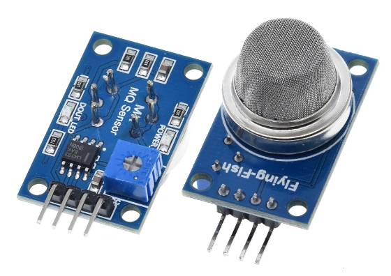
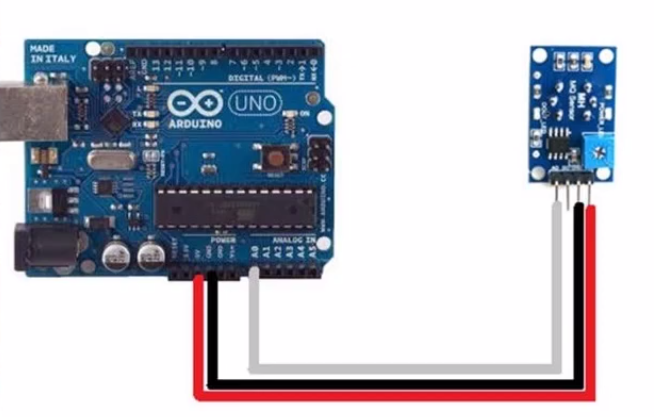
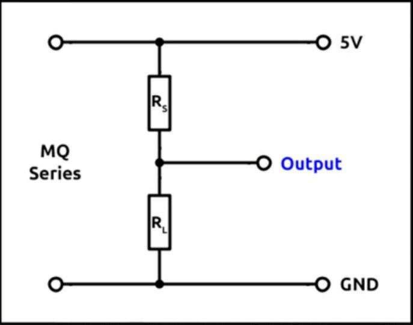

# MQ-4 sensor measurements

## Project requisites

Bash script (`./monitor.sh`) requires `xterm` and `python3`.
Python program (`./plotSerial.py`) requires `python3` and `pip3` modules: `matplotlib` and `pyserial`.

## MQ-4 sensor

I bought this one:
https://es.aliexpress.com/item/1005006004926476.html?spm=a2g0o.order_list.order_list_main.5.353f194dJjpYyV&gatewayAdapt=glo2esp

## Quick start

First you must calibrate the sensor. Then, install Arduino IDE (https://www.arduino.cc/en/software) and configure it (port, board, etc.).

Linux may need to give permissions to the port: `sudo chmod 777 /dev/ttyACM0`.

Connect the MQ-4 sensor to Arduino's board:

* MQ-4 VCC to Arduino's 5V pin.
* MQ-4 GND to Arduino's GND pin.
* MQ-4 A0 to Arduino's A0 (analog in).

Then, load the program `./CH4-sensor.ino`, and run it. You may open serial monitor or plotter to watch the measurements in real time.

The first time, leave the sensor connected some hours (over 24 hrs. recommended).

Check the [data sheet](./MQ4-DataSheet.pdf) to understand the source code, although everything is well explained there. Take into account the voltage divider as an important clue to solve the calculations:

As you can see, we can get the load resistance just using the polymeter between A0 and GND.

You could also run the program `./TwoSensors/TwoSensors.ino`. That one, duplicates the calibration and measurement to support two MQ-4 sensors using the same Arduino board.

## Monitoring

Once the sensor is calibrated, you may launch external monitor (better than Arduino's built-in plotter): `./plotSerial.py`.

Arduino program must be run with strict output (only ppm data values through serial port). So, the variable `EXTERNAL_PYTHON_MONITOR` at the very beginning of `./CH4-sensor.ino` source code, must be set to true. Then run it and launch the `./monitor.sh` script at a linux terminal.

You will have 2 pop-up windows:

* Graph (move and resize as you prefer).
* Xterm to optionally reset the graph data (this may be useful when scaling is "broken" due to peak values of ppm measured).

The './TwoSensors' subproject, symlinks the monitoring script (`./monitor.sh`) and uses a variant version for `./plotSerial.py` (two y-axis values must be represented).

## Be creative

Add LEDs, buzzers or whatever consider important for your specific application. Here the most simple layout is shown as this is used to measure CH4 gas inside a *biomethane production reactor*.

## Sources

This project has been refactored according to my preferences, drawing inspiration primarily from these sources:

https://www.youtube.com/watch?v=ihxuKCD-zFw
https://uelectronics.com/producto/mq-4-detector-de-gas-metano/
