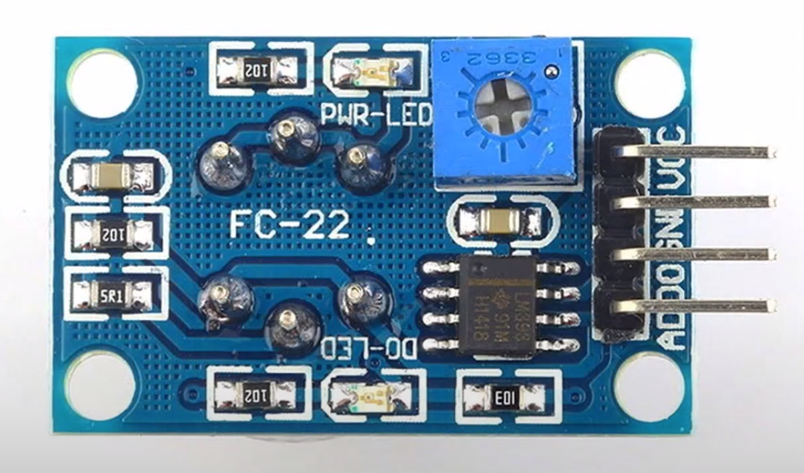

# MQ-4 sensor measurements

## Project requisites

This project is described for Linux systems, although Microsoft Windows or Mac OS could be used with the equivalent software required.

We will use a terminal (console) with bash interpreter to run `monitor.sh` script which also requires `xterm` installed.
Python program `./plotSerial.py` requires `python3` with `pip3` modules: `matplotlib` and `pyserial`.

## MQ-4 sensor

MQ Series are a set of sensors used to detect gases. Each one is specialized in a specific gas, with the MQ-4 being suitable for methane and natural gas.

I bought this one:
https://es.aliexpress.com/item/1005006004926476.html?spm=a2g0o.order_list.order_list_main.5.353f194dJjpYyV&gatewayAdapt=glo2esp

As you can see in the figure, the sensor has 4 connection pins. An analog output pin A0, a digital pin (which we won't use in our project and is used to activate the 5V output (1) for a specific threshold configurable with the blue potentiometer in the drawing), and the power supply pins (VCC and GND ground).

## Quick start

Firstly install Arduino IDE (https://www.arduino.cc/en/software) and configure it (port, board, etc.).

Linux may need to give permissions to the port: `sudo chmod 777 /dev/ttyACM0` (or use the corresponding device in your case).

Connect the MQ-4 sensor to Arduino's board:

* MQ-4 VCC to Arduino's 5V pin.
* MQ-4 GND to Arduino's GND pin.
* MQ-4 A0 to Arduino's A0 (analog in).

Then, load the program `./CH4-sensor.ino`, and run it. You may open serial monitor or plotter to watch the measurements in real time.

The first time used, leave the sensor connected some hours (over 24 hrs. recommended).

Check the [data sheet](./MQ4-DataSheet.pdf) to understand the source code, although everything is well explained there. Take into account the voltage divider as an important clue to solve the calculations:

As you can see, we can get the load resistance (RL) just using the polymeter between sensor pins A0 and GND (data sheet provides a value for it which can be adjusted, but it's possible that the sensor may have a slightly different value for this resistance due to the manufacturing or transportation process).

Below, we will describe the fundamentals that govern the program, although, as we mentioned, the source code is commented to facilitate its reading and understanding.

From the voltage divider, we deduce the value of Rs (sensor resistance): `RS = V * RL / VS`, where RL is the load resistance, V is 5 volts, and VS is the measured voltage (Vout) of the sensor recorded on the analog pin.

But we still need to complete the **calibration** phase. To do this, we look at the sensitivity curves in the specification sheet. From there, we obtain the parts per million (ppm) for a given RS/R0 ratio and a specific gas, where R0 is sensor resistance at 1000 ppm of CH4 in the clean air, a condition that we can reproduce. It should be noted that professionally, these types of sensors are calibrated in atmospheres with known ppm levels.

Looking at the air curve, we see that it is horizontal, meaning that RS/R0 is constant and approximately equals 4.3., then we can deduce R0 = RS/4.3. So, during the calibration phase, we obtain RS from the measured voltage, and from this, we deduce R0 for the specific sensor.

Once we have obtained the R0 of the sensor, we look at the methane (CH4) curve. Since graph is represented with logarithmic scale, we see that these curves are approximately straight lines, which greatly facilitates the calculations, as we know that the equation of a straight line in this scale would be: `log y = m * log x + b`, where y is the ratio RS/R0.

We then take two points, for example (x=1000 ppm, y = 1) and (x=10000 ppm, y = 0.43). Applying logarithms, we have: `0 = 3m + b` and `-0.366531544 = 4m + b`. Subtracting them, we obtain m = -0.366531544, and from either of them, we deduce b = 1.099594632. With the slope (m) and the intercept (b), we can now solve x (ppm) for a given RS/R0 ratio: `log x = (log(RS/R0) - b)/m`, so `x = 10 ^((log(RS/R0) - b)/m)`. And this is precisely what the `ppm` function does in the source code.

### Two sensors connected

You could also run the program `./TwoSensors/TwoSensors.ino`. That one, duplicates the calibration and measurement to support two MQ-4 sensors using the same Arduino board. In this way, you could use one sensor to place it inside the biomethane reactor, and another sensor for external safety measurement (leak detection) at the same time.

## Monitoring

You may launch external monitor (better than Arduino's built-in plotter) which has been developed using python language: `./plotSerial.py`. A wrapper `./monitor.sh` script is provided to automate 2 pop-up windows:

* Graph (move and resize as you prefer).
* Xterm to optionally reset the graph data (this may be useful when scaling is "broken" due to peak values of ppm measured).

Then, run the script `./monitor.sh` in a console, and adjust and move to your liking the window with the real-time graph and the auxiliary reset `xterm` window.

The `./TwoSensors` subproject, symlinks the monitoring script (`./monitor.sh`) and uses a variant version for `./plotSerial.py` where two y-axis values shall be represented.

## Debug

You can set the variable DEBUG at the very beginning of the source code to true. Then, open the Arduino serial console to see the calibration phase and output of real time values measured. This variable value must be set to false when external monitor is used, and the serial monitor of Arduino must be closed to avoid the "resource busy" error in such monitoring procedure. 

## Be creative

Add LEDs, buzzers or whatever consider important for your specific application. Here the most simple layout is shown as this is used to measure CH4 gas inside a *biomethane production reactor*.

## Sources

This project has been refactored according to my preferences, drawing inspiration primarily from these sources:

https://www.youtube.com/watch?v=ihxuKCD-zFw
https://uelectronics.com/producto/mq-4-detector-de-gas-metano/
